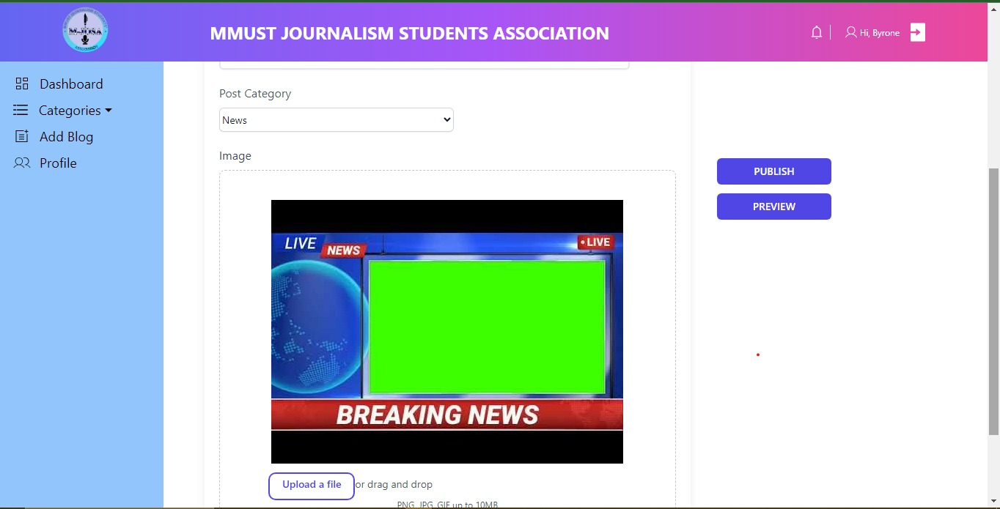

# MMUST JOSA - Journalism Blog Website
> Welcome to the JOSA Journalism Blog Website!
>> A journalism blog website for Masinde Muliro University Journalism Students Association <MMUST JoSA>.
>>> Live demo [_here_](https://www.example.com). <!-- Link where the project is hosted . -->

## Table of Contents
* [General Info](#general-information)
* [Technologies Used](#technologies-used)
* [Features](#features)
* [Screenshots](#screenshots)
* [Setup](#setup)
* [Usage](#usage)
* [Project Status](#project-status)
* [Room for Improvement](#room-for-improvement)
* [Acknowledgements](#acknowledgements)
* [Contact](#contact)

## General Information
- This repository contains the development files for the JOSA Journalism Blog Website, created for the Journalism Students Association.
The JOSA Journalism Blog Website is a project initiated by the Journalism Students Association to create a dynamic platform for students and enthusiasts to engage with journalism-related content. It aims to serve as a hub for articles, news, and discussions pertaining to the field of journalism

- The primary purpose of this project is to:
       - Facilitate Knowledge Exchange
       - Create a Community Hub
       - Support Skill Development
       - Stay Updated

- The Journalism Students Association recognized the need for a centralized platform where students could showcase their work, engage in meaningful discussions, and access resources beneficial for their journalistic pursuits. The project was undertaken to empower students, create networking opportunities, and foster a culture of learning and collaboration within the journalism community.

## Technologies Used
- React - version 18.0.2
- Tailwind CSS - version 3.3.5
- Vite - version 4.4.5

## Features
- Article Publishing: Members can publish articles related to journalism.
- User Profiles: Members can create profiles and manage their published content.
- Categories and Tags: Organize articles under different categories and tags for easy navigation.
- Search Functionality: Users can search for specific articles based on keywords.
- Responsive Design: Ensuring accessibility across various devices.

## Screenshots

## Setup
How to setup one's local environment / get started with the project.

## Usage
#### Use Cases
1. Creating and Publishing an Article
To create and publish an article on the JOSA Journalism Blog Website, follow these steps:

2. Searching for Articles
To search for articles by a specific keyword or tag:

3. Viewing Article Details
To view details of a specific article:

4. Managing User Profiles
To manage user profiles (assuming a user model exists):

5. Feedback
To comment on an article: 

## Project Status
Currently, the website is in the development phase. 
We are actively working on building its structure, design, and functionality.

## Room for Improvement
#### Areas for Improvement
1: Enhance the user interface for a more intuitive user experience. Focus on responsive design and accessibility to accommodate various devices.

2: Implement more robust user authentication and authorization mechanisms to ensure data security and user privacy.

3: Enhance the article drafting and editing functionalities.

4: Improve SEO for better search engine visibility.

#### To Do
Future Features
1: Implement a comment section for articles to encourage user engagement and discussions among the community.

2: Introduce a notification system to alert users about new articles, comments, or interactions within the platform.

## Acknowledgements
This project was developed by SPA, a dedicated team of programmers, working in collaboration with the Journalism Students Association (JOSA). The team would like to acknowledge:

- JOSA: We extend our gratitude to the Journalism Students Association for entrusting us with the implementation of the JOSA Journalism Blog Website. It has been an enriching experience working with the club to bring this project to fruition.

- Inspiration: The project was inspired by the vision and goals set forth by the JOSA members to create a platform for journalism students to connect and share their passion for the field.

- Support: Special thanks to the members of JOSA for their valuable input, feedback, and continuous support throughout the development phase. Their insights have been instrumental in shaping the direction of this project.

- Collaboration: We appreciate the collaborative effort between the SPA and JOSA, which has been crucial in designing and implementing features aligned with the club's objectives.

## Contact
[Elvis Amiani- SPA Team Leader](https://www.flynerd.pl/) - feel free to contact us!

                                  Created by SPA
